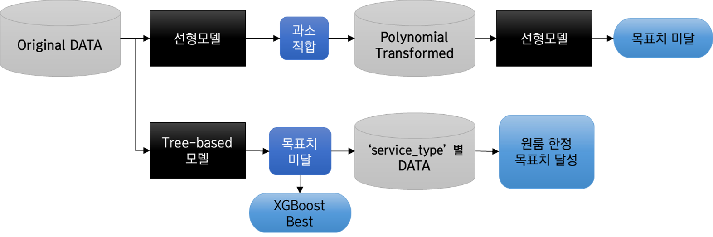
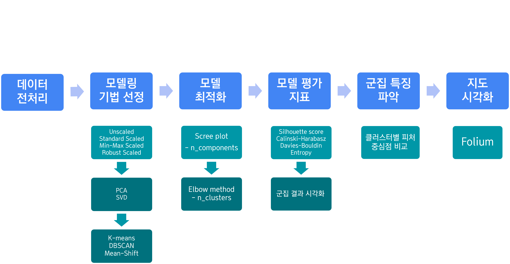
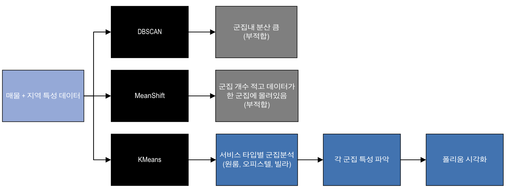

## 2023-HARDzip Project

# 사회 초년생 특화 부동산 매물 검색 시스템

### • Project nickname : 집구하기힘들조

### • Project execution period : 2023.05.03~2023.05.24

### • Members: 박현준, 김지윤, 김은비, 김지연, 박성준, 이서현

### • 멀티캠퍼스 데이터분석&엔지니어 과정(Python) 24회차 세미프로젝트

## Description

집구하기힘들조는 사회 초년생 특화 부동산 매물 검색 시스템으로, 한정된 예산 안에서 청년들의 선호 요소를 고려하여
가격과 주거 만족도를 동시에 상승시킬 수 있도록 청년들의 라이프스타일까지 고려한 매물을 찾도록 도와주는 시스템

- 지역 데이터와 다양한 데이터를 결합하여 매물과 지역에 대한 정성적 특징을 반영한 모델 구축
- 주거 생활에 중요한 어떤 다양한 요소가 있는지 또 이런 요인들이 가격에는 어떤 영향을 미치는지 분석

 

시스템 흐름도

 

### Analysis

| 분석기법   | 내용                                                               | 결과                              |
| ---------- | ----------------------------------------------------------------- | --------------------------------- |
| 지도시각화 | 군집, 텍스트 기반 매물군집 지도 시각화                             | folium_map.ipynb / folium_results |
| 군집       | 매물의 특징파악 및 유형화                                          | clustering.ipynb                  |
| 회귀       | 지역 및 매물특징을 고려한 적정가격 분석, 예측                      | regression.ipynb                  |
| 텍스트     | 매물 정보 텍스트 대상 토픽분석, 워드클라우드 통한 매물 특징 시각화 | nlp.ipynb                         |

 
 

회귀모델링 흐름도

## 

군집분석 절차

## 

군집모델링 흐름도

## 

 

### Data Source

- 지역데이터
  - 인구주택총조사
  - 국가통계포털
  - 통계지리정보시스템
  - 에어코리아
  - SGIS 통계청 API
  - 공공데이터포털
- 매물데이터
  - 직방 API
  - Kakao API

## Environment

파이썬, 주피터노트북

> Python Version 3.9.7 (Window)

 

## Prerequisite

prerequisites.txt

 

## Files

### data preparation

`crawler_zigbang.py` 월세와 전세 부동산 매물 정보 크롤링(zigbang) 
`data_preparation.py` 군집, 회귀 데이터 프레임 생성 
`data_preprocess.py` 군집, 회귀 데이터 프레임의 전처리 
`sgis.py` 통계 데이터 수집 

### models

`nlp.py` topic modeling & word cloud 
`regression.py` ML 회귀모델 
`clustering_models.py` ML 군집모델 

### visualization

`eda_plot.py` eda 시각화 
`folium_data_prep.py` folium에 사용할 데이터프레임 생성 
`folium_visualize.py` folium html 생성 
`perform_clustering.py` 군집 시각화 

## Usage

`main.py`
